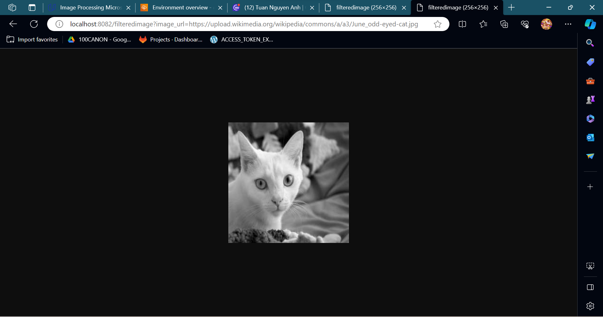

# Image Processing Microservice on AWS

***

## Getting Startsh -o

### GET /filteredimage?image_url={{URL}}

An example with 200 response:

```
http://projectstartercode2-dev.us-east-1.elasticbeanstalk.com/filteredimage?image_url=https://upload.wikimedia.org/wikipedia/commons/a/a3/June_odd-eyed-cat.jpg
```
```
http://localhost:8082/filteredimage?image_url=https://upload.wikimedia.org/wikipedia/commons/a/a3/June_odd-eyed-cat.jpg
```




An example with 422 response (wrong extension):

```
http://projectstartercode2-dev.us-east-1.elasticbeanstalk.com/filteredimage?image_url=https://upload.wikimedia.org/wikipedia/commons/a/a3/June_odd-eyed-cat.jpga
```

An example with 400 response (something wrong, maybe broken url):

```
http://projectstartercode2-dev.us-east-1.elasticbeanstalk.com/filteredimage?image_url=https://upload.wikimedia.org/wikipedia/commons/a/a3/June_odd-eyed-catafsafsa.jpg
```

Another example with 400 response (empty url):

```
http://projectstartercode2-dev.us-east-1.elasticbeanstalk.com/filteredimage?image_url=
```

***